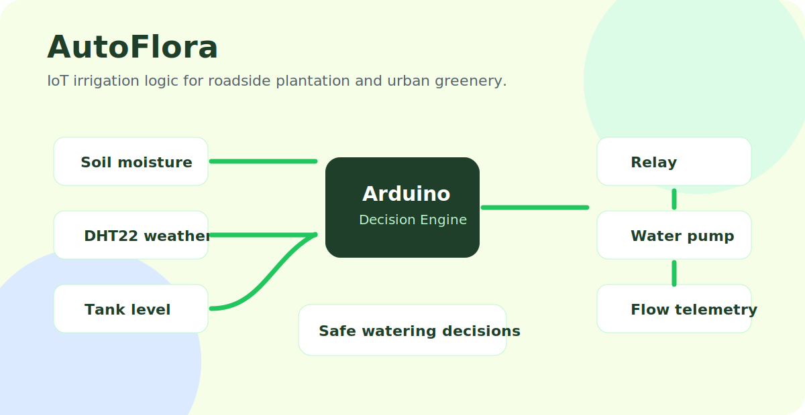

# AutoFlora: IoT Framework for Urban Roadside Plantation

AutoFlora is an Arduino-based smart irrigation prototype for urban roadside plantation. It combines soil moisture sensing, weather-aware decision logic, tank-level monitoring, flow telemetry, and pump control to water plants only when conditions are safe and useful.



## Why It Exists

Roadside plantations are often hard to maintain manually because water need changes with soil dryness, tank level, weather, and hardware reliability. AutoFlora demonstrates a low-cost embedded system that can sense those conditions and make irrigation decisions automatically.

## Hardware

- Arduino Uno
- DHT22 temperature and humidity sensor
- MH-series resistive soil moisture sensor
- HC-SR04 ultrasonic distance sensor for tank level
- YF-S201 flow sensor
- Relay module
- Water pump

## Pin Map

| Component | Arduino Pin |
|---|---|
| DHT22 data | `7` |
| Soil moisture | `A0` |
| HC-SR04 trigger | `9` |
| HC-SR04 echo | `10` |
| Relay / pump control | `8` |
| YF-S201 flow sensor | `3` |

## What The Code Does

- Reads soil moisture and converts it into a moisture percentage.
- Reads humidity and temperature from the DHT22.
- Measures tank level using ultrasonic distance.
- Counts flow sensor pulses through an interrupt.
- Turns the pump on only when the soil is dry and the tank is not too low.
- Avoids irrigation when humidity and temperature suggest rain-like conditions.
- Prints sensor state, flow rate, tank level, and pump decision to Serial.

## Decision Logic

```text
Read sensors
  -> check tank safety
  -> check rain-like weather condition
  -> check soil dryness
  -> switch pump relay
  -> print telemetry
```

The pump is disabled when:

- The tank level is below the safety threshold.
- Humidity is high and temperature is low enough to suggest rain-like conditions.
- Soil moisture is already sufficient.

The pump is enabled when:

- Tank level is safe.
- Rain-like condition is not detected.
- Soil raw reading is above the dry threshold.

## Quick Start

1. Install the Arduino IDE.
2. Install the `DHT` library.
3. Open `roadside_plant_watering_system.ino`.
4. Verify the pin wiring.
5. Calibrate `AIR_VALUE`, `WATER_VALUE`, and `SOIL_DRY` for your soil sensor.
6. Upload to Arduino Uno.
7. Open Serial Monitor at `9600` baud.

## Calibration Notes

The soil sensor calibration constants are project-specific:

```cpp
#define AIR_VALUE    1023
#define WATER_VALUE  300
#define SOIL_DRY     700
```

Measure your sensor in dry air, water, and actual soil before field use.

## Repository Structure

```text
AutoFlora-An-IoT-Framework-for-Urban-Roadside-Plantation/
  roadside_plant_watering_system.ino
  README.md
  docs/
    readme-preview.svg
```

## Future Improvements

- Add weather API integration through ESP32 or a connected gateway.
- Add LoRa/Wi-Fi telemetry for roadside deployment.
- Store irrigation logs in a cloud dashboard.
- Add solar power monitoring.
- Add multiple soil zones and per-zone pump valves.
- Add waterproof enclosure and field testing notes.

## Safety Notes

Use proper relay isolation, waterproofing, fuse protection, and pump power handling. Do not connect mains voltage directly unless you are qualified to work with electrical systems.

