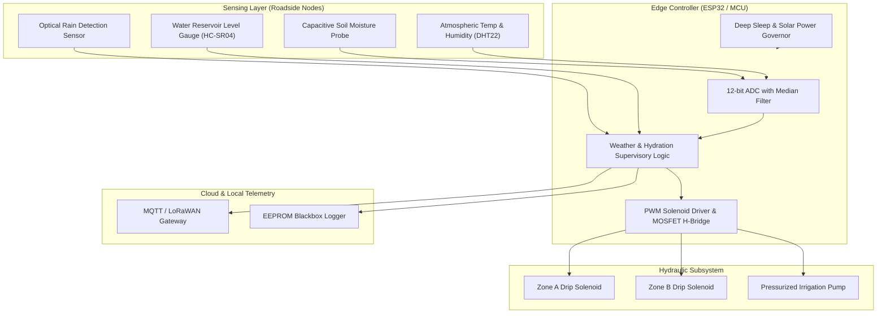
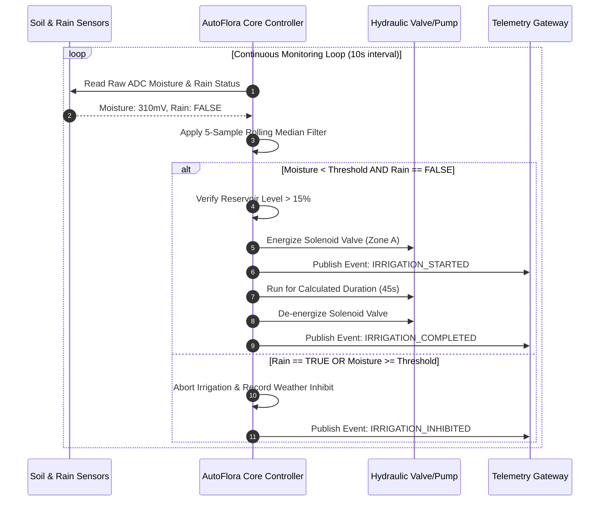
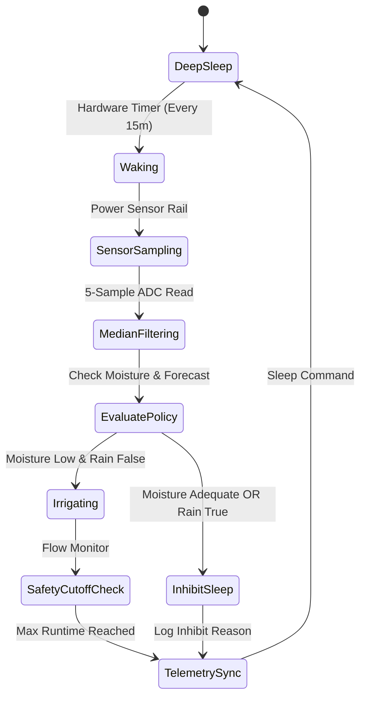

# AutoFlora: System Architecture & Hardware Topology

AutoFlora is an autonomous IoT ecosystem engineered to sustain urban roadside vegetation and highway green corridors. It couples distributed capacitive soil moisture sensor arrays, weather-predictive failsafes, dynamic flow telemetry, and solar-power management.

## 1. System Topology

## 2. Irrigation Decision Sequence

## 3. Controller State Machine

## 4. Architectural Decision Records (ADR)
- **ADR-001: Capacitive over Resistive Sensing**: Resistive probes corrode within 3 weeks in alkaline roadside soil. AutoFlora mandates corrosion-resistant capacitive probes with conformal PCB coating.
- **ADR-002: Local Failsafes over Cloud Dependence**: Network connectivity along remote highways is intermittent. All irrigation gating decisions execute strictly on edge MCU hardware.
